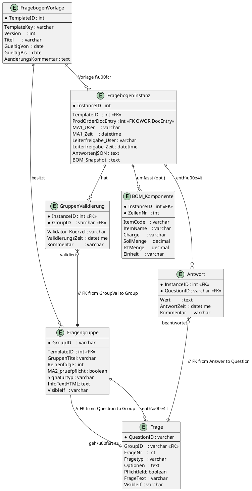

# Production 3.0 Datenarchitektur – GMP-konforme Fragebogenverwaltung

## Überblick
Diese Dokumentation beschreibt die GMP-konforme Datenstruktur für die digitale Erfassung und Verarbeitung von Fragekatalogen in einer Cannabis-Produktionsumgebung. Die Architektur basiert auf SAP Business One und nutzt User-Defined Tables (UDTs) sowie User-Defined Objects (UDOs) für eine normalisierte Speicherung der Fragebögen und Antworten. Ziel ist es, Fragebogen-Vorlagen mit Versionierung und Gültigkeitszeiträumen zu verwalten und ausgefüllte Fragebögen sicher mit Produktionsaufträgen zu verknüpfen. Dabei werden GMP-Anforderungen wie das Vier-Augen-Prinzip (zweiter Prüfer, „MA2“), elektronische Signaturen und lückenlose Audit-Trails berücksichtigt. Die Lösung gliedert sich in zwei Bereiche:

- **Logische Datenstruktur (Tabellenmodell):** Normalisierte Tabellen in SAP B1 zur Ablage von Fragebogen-Vorlagen, Fragengruppen, Fragen, ausgefüllten Instanzen und zugehörigen Antworten, inkl. Validierungen und optionalen Stücklisten-Snapshots. Diese Tabellen werden mittels UDT/UDO in SAP angelegt und als eigenes Geschäftsobjekt verfügbar gemacht. Beziehungen zwischen den Tabellen sorgen für referenzielle Integrität (z. B. jede Antwort referenziert eine Frage, jede Fragen-Gruppe gehört zu einer Vorlage etc.).
- **JSON-Integrationslogik (SurveyJS Import/Export):** Mechanismen zum Import von Fragebogen-Templates aus SurveyJS-Designer-JSON und Export von ausgefüllten Antworten als JSON. SurveyJS verwendet JSON zur Definition von Umfragen und liefert Ergebnisse als JSON-Objekte. Diese Integration ermöglicht es, Fragebögen visuell zu gestalten und zu versionieren sowie die ausgefüllten Daten für Archivierung oder andere Systeme bereitzustellen, ohne von der zugrunde liegenden SAP-Datenstruktur abzuweichen.

Im Folgenden werden zunächst alle relevanten Tabellen der Datenbankarchitektur mit ihren Feldern, Datentypen und dem Zweck beschrieben. Anschließend illustriert ein UML-Diagramm die Gesamtstruktur und Beziehungen. Abschließend wird erläutert, wie die JSON-Integration mittels SurveyJS erfolgt und welche Felder dabei insbesondere genutzt werden.

---

## Fragebogen-Vorlage (Template)
Die Tabelle Fragebogen-Template verwaltet die Fragekatalog-Vorlagen inklusive Versionierung und Gültigkeitszeiträumen. Jede Zeile entspricht einer Version eines bestimmten Fragebogens. Neue Versionen können angelegt werden, ohne alte Daten zu verlieren – über Gültigkeitsdaten wird gesteuert, welche Version aktuell aktiv ist. Wichtige Metadaten wie Änderungs-Kommentar und Zeitraum stellen sicher, dass die Änderungen nachvollziehbar bleiben (GMP-Anforderung der Dokumentation von Änderungen).

**Tabelle: FragebogenVorlage (UDT, z. B. als No Object oder Master Data deklariert)**

| Feld                | Typ                        | Beschreibung / Zweck                                                                                 |
|---------------------|---------------------------|-----------------------------------------------------------------------------------------------------|
| TemplateID (PK)     | Integer (Auto) oder NVARCHAR | Eindeutige ID der Vorlage (Primärschlüssel). Kann als Code der UDT dienen. Dient zur Verknüpfung mit Gruppen und Instanzen. |
| TemplateKey         | NVARCHAR                  | Schlüssel oder Name des Fragebogens (z. B. Formular-Typ). Gruppiert Versionen desselben Fragebogens. Beispiel: "ProdProtokollCannabis". |
| Version             | Integer                   | Versionsnummer der Vorlage. Wird hochgezählt bei Änderungen. Zusammen mit TemplateKey eindeutig.    |
| Titel               | NVARCHAR                  | Titel/Bezeichnung der Fragebogen-Version (für Benutzeranzeige).                                     |
| GueltigVon          | Date                      | Datum, ab dem diese Version gültig ist (inkl.).                                                    |
| GueltigBis          | Date                      | Datum, bis zu dem diese Version gültig ist (inkl.). Kann NULL für unbefristet sein.                |
| AenderungsKommentar | NVARCHAR                  | Kommentar zur Änderung in dieser Version (Changekontrolle).                                         |
| ErstelltAm          | DateTime (optional)       | Erstellungszeitpunkt der Version (Audit-Trail).                                                    |
| ErstelltVon         | NVARCHAR (optional)       | Benutzer, der die Version angelegt hat.                                                            |

Hinweis: Die Vorlagen-Tabelle dient primär der Versionierung. Bei Aktivierung einer neuen Version kann über GueltigBis der Vorgänger automatisch außer Kraft gesetzt werden. Innerhalb SAP B1 werden UDTs in der Datenbank mit @-Prefix angelegt – z. B. könnte die Tabelle intern [@QUEST_TEMPLATE] heißen. Diese Tabelle ist nicht direkt Teil eines UDO, sondern wird bei Bedarf über separate Formulare oder Tools gepflegt.

---

## Fragengruppen
Die Tabelle Fragengruppen definiert die logische Struktur der Fragebögen in Gruppen/Sektionen. Jede Fragengruppe gehört zu genau einer Fragebogen-Vorlage und bündelt thematisch zusammengehörige Fragen. Zudem werden hier prüfpflichtige Gruppen (Vier-Augen-Prinzip) und Signaturen konfiguriert. Beispielsweise kann eine Gruppe „Raumstatus überprüfen“ festlegen, dass ein zweiter Mitarbeiter (MA2) gegenzeichnen muss, um die Eingaben zu bestätigen.

**Tabelle: Fragengruppe (UDT, z. B. Master Data UDT)**

| Feld            | Typ         | Beschreibung / Zweck                                                                                                   |
|-----------------|-------------|----------------------------------------------------------------------------------------------------------------------|
| GroupID (PK)    | NVARCHAR    | Eindeutige Kennung der Fragengruppe. Wird auch als Code verwendet (z. B. "raumstatus_pruefen"). Sollte innerhalb einer Vorlage einzigartig sein (idealerweise global eindeutig). |
| TemplateID (FK) | Integer     | Verweis auf die zugehörige Fragebogen-Vorlage (TemplateID aus oben genannter Tabelle).                                 |
| GruppenTitel    | NVARCHAR    | Überschrift/Titel der Fragengruppe (wird dem Anwender angezeigt).                                                      |
| Reihenfolge     | Integer     | Bestimmt die Anzeige-Reihenfolge der Gruppe innerhalb des Fragebogens.                                                |
| MA2_pruefpflicht| Boolean (Y/N)| Kennzeichnet, ob für diese Gruppe eine zweite Prüfperson (MA2) erforderlich ist. Ist der Wert wahr, muss nach Beantwortung der Fragen eine zweite qualifizierte Person die Gruppe validieren (Vier-Augen-Prinzip). |
| Signaturtyp     | NVARCHAR (Enum) | Art der erforderlichen Signatur für diese Gruppe. Mögliche Werte z. B.: "None" (keine gesonderte Signatur), "MA2" (zweite Mitarbeiter-Unterschrift), "Leiter" (Leiter der Herstellung muss signieren). Bestimmt den Modus der Gruppenvalidierung. Beispiel: Die Gruppe „Eingangsmaterialien ausbuchen“ erfordert eine Leiter-Signatur (Signaturtyp = "Leiter") und keine MA2-Prüfung. |
| InfoTextHTML    | Text        | Optionaler HTML-Infotext zur Gruppe. Enthält Hinweise oder Anweisungen, die vor den Fragen der Gruppe angezeigt werden (z. B. Sicherheitsinformationen oder erklärender Text). Dieser Inhalt entspricht einem HTML-Element im SurveyJS-Template. |
| VisibleIf       | NVARCHAR    | Optionaler Sichtbarkeitsausdruck (Bedingung) für die gesamte Gruppe. Die Gruppe wird nur angezeigt, wenn die Bedingung erfüllt ist. Syntax analog SurveyJS (z. B. "{pause_durchgefuehrt} = true" damit eine Pausen-Fragengruppe nur erscheint, wenn zuvor Pause durchgeführt mit Ja beantwortet wurde). |

Alle Fragengruppen einer Vorlage können in SAP über diese Tabelle verwaltet werden. GroupID dient als Schlüssel und wird in der Fragen- und Validierungstabelle referenziert. Die Felder MA2_pruefpflicht und Signaturtyp steuern gemeinsam die erforderlichen Gegenzeichnungen: Ist MA2_pruefpflicht = Ja, wird ein Eintrag in der Validierungstabelle durch einen zweiten Mitarbeiter erwartet. Ist darüber hinaus ein bestimmter Signaturtyp gesetzt (z. B. „Leiter“), kann dies bedeuten, dass anstelle eines MA2 eine spezifische Person (Leiter der Herstellung) die Freigabe leisten muss. Der InfoTextHTML erlaubt die Gestaltung formatierter Hinweise pro Gruppe (z. B. Auflistungen von Sollwerten, siehe JSON-Beispiel). VisibleIf ermöglicht komplexe Fragebögen, in denen bestimmte Sektionen nur bei Bedarf beantwortet werden müssen.

---

## Fragen (Frage-Definitionen)
Die Fragen-Tabelle enthält die Definition jeder einzelnen Frage im Fragebogen, mit Referenz auf die zugehörige Gruppe. Hier wird festgelegt, welcher Fragetyp vorliegt (z. B. Ja/Nein, Text, Mehrfachauswahl), welche Auswahloptionen es gibt, ob die Frage obligatorisch ist und wie die Frage genau lautet. Durch die Normalisierung in eine separate Tabelle können Fragen einfach versioniert und wiederverwendet werden.

**Tabelle: Frage (UDT, z. B. Master Data Lines UDT – kann als Zeilenobjekt einer Fragengruppe angesehen werden)**

| Feld           | Typ         | Beschreibung / Zweck                                                                                                   |
|----------------|-------------|----------------------------------------------------------------------------------------------------------------------|
| QuestionID (PK)| NVARCHAR (Code) | Eindeutige Kennung der Frage (optional; alternativ zusammengesetzter Schlüssel aus GroupID+FrageNr). Kann dem SurveyJS name Feld entsprechen (z. B. "eingangsmaterial_ausgebucht"). |
| GroupID (FK)   | NVARCHAR    | Referenz auf die übergeordnete Fragengruppe (GroupID). Bestimmt Kontext und Gruppierung der Frage.                    |
| FrageNr        | Integer     | Positionsnummer der Frage innerhalb der Gruppe (Reihenfolge der Frage).                                               |
| Fragetyp       | NVARCHAR    | Typ der Frage, entspricht dem Frage-Typ im SurveyJS-Format. Beispiele: "boolean" (Ja/Nein-Frage), "text" (Freitext), "radiogroup" (Single-Choice) usw.. Dieser Typ bestimmt, wie die Antwort erfasst wird (Checkbox, Textfeld, Dropdown etc.). |
| Optionen       | Text        | Mögliche Antwortoptionen, falls zutreffend (bei Auswahlfragen). Abgelegt als Liste oder JSON-Struktur. Beispielsweise "Ja;Nein;Nicht zutreffend" oder als JSON-Array mit Werten und Anzeigetext. Bei Freitext- oder Booleschen Fragen bleibt dieses Feld leer. |
| Pflichtfeld    | Boolean (Y/N)| Kennzeichnung, ob die Beantwortung der Frage verpflichtend ist (isRequired in SurveyJS). Pflichtfragen müssen vor Abschluss beantwortet sein (Validierung). |
| FrageText      | NVARCHAR    | Der genaue Fragetext bzw. die Beschriftung, die dem Benutzer angezeigt wird (title in SurveyJS).                     |
| VisibleIf      | NVARCHAR (optional) | Sichtbarkeitsbedingung für diese einzelne Frage (wenn abhängig von vorherigen Antworten). Syntax analog zu Group.VisibleIf, referenziert andere Fragen. Nur gesetzt, wenn die Frage konditional angezeigt werden soll. Beispiel: Ein Eingabefeld für Bemerkungen könnte VisibleIf tragen, so dass es nur erscheint, wenn in einer Ja/Nein-Frage zuvor „Nein“ gewählt wurde. |

Die Fragen-Tabelle referenziert die Gruppen-Tabelle über GroupID, wodurch alle Fragen logisch unter ihrer Gruppe hängen. QuestionID kann als eigenständiger eindeutiger Schlüssel verwendet werden, insbesondere wenn Fragen global eindeutig benannt werden. Alternativ kann ein zusammengesetzter Schlüssel (GroupID + FrageNr) die Identifizierung übernehmen. In der Praxis bietet es sich an, das SurveyJS Name-Attribut einer Frage (maschinenlesbarer Bezeichner) direkt als QuestionID zu verwenden, um die Integration zu erleichtern – dies wurde bei der Konzeption der JSON-Struktur bereits berücksichtigt (z. B. name: "leiter_herstellung_signatur" in JSON entspricht einer Frage nach der Unterschrift der Herstellungsleitung). Die Optionen-Feldinhalte werden bei Auswahllisten direkt aus dem SurveyJS-Format übernommen (siehe Beispiele für Radiogroup-Optionen im JSON). Mit diesen drei Tabellen – Vorlage, Gruppe und Frage – ist die Struktur eines Fragekatalogs vollständig in SAP B1 abgebildet. Änderungen an Fragen (z. B. Textanpassungen oder neue Antwortoptionen) werden durch Anlegen einer neuen Template-Version vorgenommen, während die bestehenden Antworten historischer Instanzen unverändert bleiben.

---

## Fragebogen-Instanz (Ausgefülltes Formular)
Die Tabelle Fragebogen-Instanz repräsentiert einen konkreten, ausgefüllten Fragebogen. Jedes Objekt dieser Tabelle entspricht dem vollständigen Durchlauf eines Fragebogens für einen bestimmten Produktionsauftrag. Diese Tabelle ist als UDO vom Typ Dokument ausgestaltet, d. h. sie fungiert als Belegkopf, der mit mehreren Zeilentabellen (Antworten, Validierungen, ggf. Komponenten) verknüpft ist. Dadurch kann in SAP Business One ein eigener Beleg-Typ geschaffen werden, der in Masken dargestellt, versioniert und mit Funktionen wie dem Änderungslog versehen werden kann.

**Tabelle: FragebogenInstanz (UDT als Document UDT, in UDO registriert)**

| Feld                 | Typ                        | Beschreibung / Zweck                                                                                 |
|----------------------|---------------------------|-----------------------------------------------------------------------------------------------------|
| InstanceID (PK, Code)| Integer (Auto) oder NVARCHAR | Eindeutige ID der Fragebogen-Instanz. Wird vom System automatisch vergeben (z. B. fortlaufende Nummer) und dient als Belegnummer. |
| TemplateID (FK)      | Integer                   | Referenz auf die zugrunde liegende Fragebogen-Vorlage (Version), nach der diese Instanz erstellt wurde. Dadurch ist nachvollziehbar, mit welcher Version die Fragen gestellt wurden. |
| ProdOrderDocEntry (FK)| Integer                  | Verknüpfung zum SAP Produktionsauftrag (Tabellen OWRK/OWOR, z. B. OWOR.DocEntry). Stellt die Beziehung zum herzustellenden Batch/Produkt her, auf den sich der Fragebogen bezieht. So ist jeder Fragebogen eindeutig einem Produktionsauftrag zugeordnet. |
| ProdOrderNummer (optional)| NVARCHAR             | Lesbare Produktionsauftragsnummer (OWOR.DocNum) – optional zur Anzeige, primär wird aber DocEntry als technischer Link verwendet. |
| MA1_User             | NVARCHAR                  | Kennung des Ausfüllenden (MA1). Der Mitarbeiter (z. B. Bediener), der den Fragebogen ausgefüllt hat. Kann z. B. Kürzel oder SAP-Benutzercode sein. |
| MA1_Zeit             | DateTime                  | Zeitstempel, wann der MA1 die Eingaben abgeschlossen/bestätigt hat. Dies markiert das Ende der Datenerfassung durch die erste Person. |
| Leiterfreigabe_User  | NVARCHAR                  | Kennung des benannten Verantwortlichen (z. B. Leiter der Herstellung oder QA), der die Gesamtfreigabe erteilt (Leiterfreigabe). |
| Leiterfreigabe_Zeit  | DateTime                  | Zeitstempel der Freigabe durch den Leiter. Erst mit dieser Unterschrift ist der Datensatz GMP-konform abgeschlossen. |
| AntwortenJSON        | Text                      | JSON-Archiv aller Antworten dieser Instanz. Hier wird der komplette Fragebogen-Inhalt mit Fragenamen und Werten einmalig als JSON-Objekt gespeichert (wie von SurveyJS erzeugt). Dieses Archiv dient der fälschungssicheren Ablage der Rohdaten und erleichtert einen späteren Export oder Auswertung. |
| BOM_Snapshot         | Text (JSON)               | Optional: JSON-Snapshot der Stückliste (BOM) zum Zeitpunkt der Herstellung. Enthält alle Komponenten (Artikel, Chargen, Sollmengen) des Produktionsauftrags. Dient der Archivierung, um nachträglich die Materialgrundlage nachvollziehen zu können – unabhängig von späteren Änderungen im ERP. |

Diese Instanz-Tabelle bildet den Kern der operativen Datenerfassung. Beim Start eines Produktionsauftrags wird in der Regel ein neuer Datensatz angelegt, der die auszufüllenden Fragen gemäß der aktuellen Vorlage enthält. Über ProdOrderDocEntry ist die Instanz eindeutig mit einem Fertigungsauftrag verlinkt; dies erlaubt es einem SAP-Partner, z. B. per Choose From List den Auftrag auszuwählen oder automatisch beim Anlegen aus einem Auftrag den Fragebogen zu erzeugen. Die Felder MA1_User und MA1_Zeit dienen als Audit-Trail für den Bearbeiter (erstunterzeichnende Person), während Leiterfreigabe_User und -Zeit die finale Freigabe dokumentieren. Solange diese Felder leer sind, gilt der Fragebogen als noch nicht endabgeschlossen (ggf. „in Bearbeitung“ Status).

**AntwortenJSON:** Zusätzlich zur strukturierten Speicherung aller Einzelfragen wird hier die komplette Antwortmaske in JSON-Form hinterlegt. Dies entspricht dem vom SurveyJS-Frontend generierten Resultatsobjekt und erleichtert die Prüfung der Vollständigkeit der Daten außerhalb von SAP. Im JSON sind alle Frage-IDs mit den eingegebenen Werten enthalten (siehe Abschnitt JSON-Integration). Die Speicherung als Text in der Datenbank ermöglicht im Nachhinein einen direkten Vergleich mit dem Originalfragebogen oder einen Export, ohne die Daten aus den Normalisierungstabellen zu rekonstruieren.

**BOM_Snapshot:** Hier kann optional die Stückliste des Produktionsauftrags zum Zeitpunkt der Durchführung abgelegt werden. Alternativ könnte man eine separate Tabelle (siehe unten) dafür verwenden. In vielen Fällen reicht es jedoch aus, die relevanten Felder (Artikelnummern, Chargen, Mengen) als JSON zu speichern, da dies die Komplexität verringert und dennoch alle benötigten Informationen enthält. Die Tabelle FragebogenInstanz ist als UDO-Dokument registriert, wodurch sie in SAP Business One als eigenes Objekt erscheint (z. B. im Menü Benutzerdefinierte Objekte). Über die UDO-Einstellungen können Dienste wie das Änderungsprotokoll (Log) aktiviert werden, sodass jede Änderung an einem ausgefüllten Formular (falls nachträglich erlaubt) dokumentiert wird.

---

## Antworten (Einzelantworten)
Die Antworten-Tabelle erfasst jede beantwortete Frage einer Instanz als eigenen Datensatz. Sie ist als Zeilentabelle (Document Rows) im UDO eingebunden, sodass pro Fragebogen-Instanz mehrere Antwortzeilen vorhanden sind. Jede Antwort verknüpft einen gegebenen Wert mit der entsprechenden Frage und enthält zusätzliche Informationen zur Eingabezeit und eventuellen Kommentaren.

**Tabelle: Antwort (UDT als Document Rows, Child des UDO FragebogenInstanz)**

| Feld           | Typ         | Beschreibung / Zweck                                                                                                   |
|----------------|-------------|----------------------------------------------------------------------------------------------------------------------|
| InstanceID (PK, FK)| Integer  | Referenz auf die zugehörige Fragebogen-Instanz (Primärschlüsselteil, Link zum Belegkopf).                             |
| QuestionID (PK, FK)| NVARCHAR | Referenz auf die beantwortete Frage (Frage-Definition). Entspricht i. d. R. dem QuestionID aus der Fragen-Tabelle (oder dem Fragen-Name). Dieser Schlüssel identifiziert, welche Frage diese Antwortzeile abbildet. |
| Wert           | NVARCHAR oder Text | Der eingegebene Wert bzw. die gegebene Antwort. Je nach Fragetyp enthält dieses Feld z. B. "Ja" / "Nein" (Boolean), frei eingegebenen Text, ausgewählte Optionswerte etc. Einheitlich als Text gespeichert, um alle Fragetypen abzudecken. (Eine Konvertierung/normale Formatierung erfolgt bei Bedarf in der Auswertung.) |
| AntwortZeit    | DateTime    | Zeitstempel der Beantwortung durch MA1. In vielen Fällen wird dies identisch sein mit MA1_Zeit aus dem Instanzkopf, sofern der Fragebogen in einem Rutsch ausgefüllt wird. Sollte der Fragebogen jedoch über längere Zeit bearbeitet werden, kann hier ggf. der individuelle Zeitstempel pro Frage festgehalten werden (z. B. durch das UI gestützt). |
| Kommentar      | NVARCHAR    | Freitextfeld für optionale Anmerkungen des Bearbeiters zur dieser Antwort. Wird genutzt, wenn z. B. ein unerwarteter Wert oder ein Problem kommentiert werden muss (GMP fordert oft Begründungen bei Abweichungen). Dieses Feld kann vom Benutzer ausgefüllt werden, wenn ein Kommentar nötig ist. |

In der Praxis werden die Antwort-Datensätze beim Abschluss des Fragebogens erzeugt: Sobald der Benutzer (MA1) den Fragebogen absendet, iteriert die Logik über alle Fragen und legt je eine Antwortzeile an. Das QuestionID-Feld ermöglicht es, die Antwort eindeutig der Frage zuzuordnen – es sollte genau mit dem Identifier aus der Fragen-Tabelle übereinstimmen, um Konsistenz zu gewährleisten. Da SAP B1 UDOs die Verknüpfung kennen, wird InstanceID automatisch für alle zugehörigen Zeilen gesetzt. Durch die separate Antwort-Tabelle können auch Auswertungen über Antworten hinweg durchgeführt werden (z. B. alle Antworten auf eine bestimmte Frage über viele Produktionsaufträge hinweg vergleichen) ohne JSON parsen zu müssen. Zudem erlaubt es diese Struktur, das Änderungsprotokoll von SAP B1 auf Feldebene zu nutzen, falls eine Antwort nachträglich korrigiert würde (jede Zeile kann individuelle History haben, sofern aktiviert).

---

## Gruppen-Validierungen (Vier-Augen Prüfer)
Die Gruppenvalidierung-Tabelle erfasst die zweite Unterschrift bzw. Prüfung (MA2) pro Fragengruppe innerhalb einer Instanz, sofern für die Gruppe eine MA2-Prüfpflicht konfiguriert wurde. Sie ist ebenfalls als Zeilentabelle im UDO eingebunden (weiteres Child der Instanz), mit typischerweise deutlich weniger Einträgen als die Antworten-Tabelle – nämlich höchstens einen Eintrag pro prüfpflichtiger Gruppe.

**Tabelle: GruppenValidierung (UDT als Document Rows, Child des UDO)**

| Feld               | Typ         | Beschreibung / Zweck                                                                                                   |
|--------------------|-------------|----------------------------------------------------------------------------------------------------------------------|
| InstanceID (PK, FK)| Integer     | Referenz zur Fragebogen-Instanz (Belegkopf). Verknüpft Validierungen eindeutig mit einem ausgefüllten Fragebogen.     |
| GroupID (PK, FK)   | NVARCHAR    | Referenz zur Fragengruppe, die validiert/geprüft wurde. Entspricht der GroupID aus der Gruppen-Tabelle. Jede prüfpflichtige Gruppe soll hier maximal einen Validierungseintrag haben. |
| Validator_Kuerzel  | NVARCHAR    | Kürzel oder Benutzer-ID der prüfenden Person (MA2 oder entsprechende Rolle), die diese Gruppe freigegeben/validiert hat. (Im Falle Signaturtyp „Leiter“ wäre hier z. B. das Kürzel des Produktionsleiters statt eines zweiten Mitarbeiters.) |
| ValidierungsZeit   | DateTime    | Zeitpunkt, an dem die Gruppe validiert wurde (Unterschrift-Zeitstempel der zweiten Person).                           |
| Kommentar          | NVARCHAR    | Optionales Feld für Anmerkungen der zweiten Prüferperson. Wird genutzt, falls während der Prüfung Abweichungen festgestellt wurden oder zusätzliche Erläuterungen nötig sind. |

Die GruppenValidierung-Einträge werden typischerweise zeitnah nach dem Ausfüllen der jeweiligen Gruppe vorgenommen. In einem digitalen Workflow könnte die Applikation nach Abschluss einer Gruppe (durch MA1) den Eintrag für MA2 erwarten und diesen speichern, sobald erfolgt. Alternativ erfolgt die Gruppengegenzeichnung gesammelt am Ende; in beiden Fällen landen die Daten in dieser Tabelle. Die Kombination aus InstanceID und GroupID bildet den Primärschlüssel und stellt sicher, dass pro Instanz jede Gruppe höchstens einmal gegengezeichnet werden kann. Über Validator_Kuerzel wird die verantwortliche Person hinterlegt; oft wird dies ein Kürzel oder Username sein, der auf einen SAP-Benutzer oder ein Mitarbeiterstammobjekt verweist. Diese Tabelle implementiert somit die GMP-Forderung nach dokumentierter Zweitprüfung (Vier-Augen-Prinzip) für definierte Prozessschritte. Ein Beispiel aus der JSON-Definition: die Gruppe „Materialbereitstellung Primärpackmittel“ ist MA2-pflichtig ("requiresMA2": true in der Definition) – entsprechend würde nach Ausfüllen dieser Gruppe ein Eintrag mit GroupID materialbereitstellung_primaerpackmittel in dieser Tabelle erwartet, der durch den zweiten Prüfer erstellt wird.

---

## Stücklisten (BOM) Komponenten (optional)
Da ein Produktionsbegleit-Protokoll häufig auch die verwendeten Materialien dokumentiert, gibt es zwei Ansätze, die Stückliste (Bill of Materials – BOM) in die Datenstruktur zu integrieren:

- **Variante A: BOM-Snapshot als JSON – (empfohlen)** Die bereits in der Instanz-Tabelle vorgesehene Spalte BOM_Snapshot speichert die gesamte Stückliste als JSON-Objekt. Darin können Artikelnummern, Bezeichnungen, Soll- und Ist-Mengen, Chargennummern usw. enthalten sein. Vorteil: Einfachere Implementierung (nur ein Feld) und das BOM bleibt unverändert als Momentaufnahme erhalten, selbst wenn der Produktionsauftrag im ERP nachträglich bearbeitet wird. Nachteil: geringfügig erschwerte Auswertbarkeit innerhalb von SAP (JSON müsste geparst werden, z. B. via HANA JSON-SQL oder extern).
- **Variante B: Separate BOM-Komponenten-Tabelle –** Eine eigene UDT (ebenfalls als Child der Instanz-UDO) listet jede Komponentenposition als eigenen Datensatz. Diese Tabelle könnte folgendermaßen aussehen:

**Tabelle: BOM_Komponente (UDT als Document Rows, optionales Child)**

| Feld           | Typ         | Beschreibung / Zweck                                                                                                   |
|----------------|-------------|----------------------------------------------------------------------------------------------------------------------|
| InstanceID (FK, PK)| Integer  | Referenz zur Fragebogen-Instanz.                                                                                      |
| ZeilenNr (PK)  | Integer     | Laufende Nummer der Komponente (Primärschlüssel im Zusammenspiel mit InstanceID).                                      |
| ItemCode       | NVARCHAR    | Artikelnummer der Komponente (aus Stückliste).                                                                         |
| ItemName       | NVARCHAR    | Artikelbeschreibung (zum Zeitpunkt der Herstellung, für Lesbarkeit).                                                   |
| Charge         | NVARCHAR    | Chargennummer der Komponente (falls anwendbar, z. B. Wirkstoffcharge).                                                |
| SollMenge      | Decimal     | Vorgesehene Menge der Komponente gemäß Produktionsauftrag.                                                             |
| IstMenge       | Decimal     | Tatsächlich verwendete Menge (falls abweichend erfasst werden soll).                                                   |
| Einheit        | NVARCHAR    | Einheit der Menge (z. B. kg, Stk).                                                                                    |
| Weitere Felder | ...         | (z. B. Lagerort, Bemerkungen, falls benötigt)                                                                          |

Diese Tabelle würde beim Anlegen der Instanz einmalig aus dem Produktionsauftrag (Module Stückliste in SAP B1) befüllt. Damit stünde in strukturierter Form zur Verfügung, welche Materialien in dem Prozess eingeplant waren. Der Vorteil dieser Variante ist, dass Abfragen innerhalb SAP (z. B. „zeige alle verwendeten Chargen für Protokoll X“) leichter möglich sind, ohne JSON zu parsen. Der Nachteil ist erhöhter Pflegeaufwand und potentielle Redundanz (Daten aus Produktionsmodul werden dupliziert). In dieser Dokumentation werden beide Varianten erwähnt, wobei Variante A (JSON) bereits in der Instanz-Tabelle berücksichtigt ist. Ein SAP-Implementierungspartner könnte sich abhängig von den Reporting-Anforderungen für die separate Tabelle entscheiden. In diesem Fall müsste die BOM_Komponente-Tabelle ebenfalls als Kind-UDO der Instanz registriert werden (analog den Antworten und Validierungen). SAP Business One erlaubt die Verknüpfung mehrerer Child-Tabellen an ein UDO-Dokument – somit können Antworten, Validierungen und Komponenten gemeinsam unter der Instanz verwaltet werden.

---

## UML-Diagramm des Datenmodells
Nachfolgend ist das vollständige Datenmodell als UML-Klassendiagramm dargestellt. Alle Tabellen (Entitäten) mit ihren relevanten Feldern und die Beziehungen untereinander sind aufgeführt. Primärschlüssel sind mit (*) gekennzeichnet, Fremdschlüssel-Beziehungen werden durch Linien dargestellt. Dieses Diagramm kann zur besseren Visualisierung in ein PlantUML-kompatibles Tool übernommen werden.

Diagramm: UML-Datenmodell der Fragebogen-Architektur. In diesem Diagramm ist erkennbar, dass die FragebogenInstanz (UDO-Dokument) im Zentrum steht und als Elternobjekt die abhängigen Listen Antworten, GruppenValidierungen und ggf. BOM_Komponenten enthält. Gleichzeitig verweist die Instanz auf die FragebogenVorlage, damit klar ist, welche Version zugrunde lag. Die Definitionsdaten (Fragengruppe, Frage) hängen an der Vorlage und werden von den Instanzen nur referenziert. Die Pfeile deuten die Richtung der Fremdschlüssel (z. B. Answer -> Question, GroupVal -> Group) an.

---

## Integration zwischen SAP und React-Anwendung
**ACHTUNG: Die SAP Integration ist nicht Bestandteil des MVPs. Die folgenden Informationen dienen lediglich als Orientierung für die vorausschauende Implementierung der Client Komponenten.**

Um eine GMP-konforme, performante und ausfallsichere Nutzung der digitalen Fragebogenlösung im Produktionsumfeld zu gewährleisten, wird eine dedizierte Serverkomponente als Integrationsschicht zwischen SAP Business One und der React-Anwendung eingesetzt.

### Architektur und Ablauf

- **Regelmäßige Synchronisation:** Die Serverkomponente synchronisiert in festgelegten Intervallen alle für den aktuellen und die kommenden Tage relevanten Produktionsaufträge, Materiallisten und das aktuell gültige Fragekatalog-Template aus SAP Business One. Diese Daten werden als Kopie auf einem lokalen Server (z. B. im Werksnetzwerk nahe des Reinraums) vorgehalten. Dadurch ist die Webanwendung auch bei temporären SAP-Ausfällen oder Netzwerkproblemen voll funktionsfähig.

- **Datenübersetzung (SAP → SurveyJS-JSON):**
  - Die Serverkomponente liest die relevanten SAP-Tabellen (FragebogenVorlage, Fragengruppe, Frage, Validierungsgruppen) aus und übersetzt diese in das von der React-Anwendung benötigte SurveyJS-kompatible JSON-Format.
  - Dabei werden alle für die App relevanten Metadaten (z. B. Sichtbarkeitsregeln, Pflichtfelder, Validierungsgruppen, Info-Texte) korrekt abgebildet:
    - Jede Fragengruppe wird zu einer SurveyJS-"page" oder "panel" mit Titel, Sichtbarkeitsbedingungen (visibleIf) und ggf. Info-Text (InfoTextHTML).
    - Jede Frage wird als SurveyJS-Element mit Typ (type), Name (name/QuestionID), Titel (title/FrageText), Optionen (choices/Optionen), Pflichtfeld (isRequired/Pflichtfeld), visibleIf etc. erzeugt. Die Zuordnung erfolgt konsistent anhand der SAP-Feldnamen und SurveyJS-Properties.
    - Validierungsgruppen (z. B. Vier-Augen-Prinzip, MA2_pruefpflicht, Signaturtyp) werden als separate Metadaten bereitgestellt, damit die App die MA2-Logik korrekt abbilden kann.
  - Das Ergebnis ist ein SurveyJS-JSON-Objekt, das die komplette Struktur und Logik des Fragekatalogs enthält und direkt von der React-Anwendung verwendet werden kann.
  - Die gleiche Logik gilt für die Materiallisten und Produktionsaufträge: Diese werden aus SAP extrahiert und als JSON bereitgestellt, sodass die App sie wie gewohnt anzeigen und auswählen kann.

- **Bereitstellung von Produktionsaufträgen und Materiallisten:**
  - Die Serverkomponente stellt die aus SAP synchronisierten Produktionsaufträge und zugehörigen Materiallisten als JSON bereit.
  - Die React-Anwendung kann diese Aufträge wie gewohnt anzeigen, durchsuchen und auswählen, um eine neue Fragebogeninstanz zu starten.

- **Nutzung in der React-Anwendung:**
  - Die React-Anwendung greift ausschließlich auf die lokal synchronisierten und übersetzten Daten zu.
  - Nach Auswahl eines Produktionsauftrags wird der Fragebogen (basierend auf dem SurveyJS-JSON) für diesen Auftrag instanziiert und ausgefüllt.

### Rückübertragung ausgefüllter Instanzen (SurveyJS → SAP)

- **Erfassung und Export:**
  - Nach Abschluss eines Fragebogens erzeugt die React-Anwendung ein JSON-Objekt, das alle Antworten (nach SurveyJS-Schema) sowie die Audit-Trail-Informationen und die Validierungsobjekte (MA2-Bestätigungen pro Fragengruppe) enthält.

- **Übertragung und Mapping in SAP:**
  - Die Serverkomponente nimmt die ausgefüllte Fragebogeninstanz (JSON) entgegen und überträgt die Daten in die SAP-Datenstruktur:
    - Es wird ein neuer Datensatz in der Tabelle FragebogenInstanz angelegt (inkl. Referenz auf Produktionsauftrag, Vorlage, MA1, Zeitstempel, etc.).
    - Das komplette Antwort-JSON wird als Rohdatenarchiv in das Feld AntwortenJSON übernommen.
    - Für jede einzelne Frage wird ein Eintrag in der Tabelle Antwort erzeugt (InstanceID, QuestionID, Wert, AntwortZeit, Kommentar). Die Zuordnung erfolgt anhand der QuestionID/Fragenname.
    - Für jede Fragengruppe, die eine MA2-Prüfung erfordert und in der App validiert wurde, wird ein Eintrag in der Tabelle GruppenValidierung erzeugt (InstanceID, GroupID, Validator_Kuerzel, ValidierungsZeit, Kommentar). Die Zuordnung erfolgt anhand der GroupID.
  - Die Zuordnung der JSON-Felder zu den SAP-Tabellen erfolgt dabei konsistent anhand der in der SurveyJS-Definition und den SAP-Tabellen verwendeten Namen (z. B. QuestionID, GroupID).

- **Synchronisation zurück nach SAP:**
  - Die Serverkomponente sorgt dafür, dass alle abgeschlossenen und validierten Fragebogeninstanzen regelmäßig in SAP Business One übernommen werden und dort GMP-konform archiviert sind.

### Vorteile dieses Ansatzes

- Maximale Ausfallsicherheit und Performance im Reinraum.
- GMP-konforme, lückenlose Synchronisation und Archivierung.
- Klare Trennung zwischen SAP-Datenmodell und UI-optimiertem SurveyJS-Format.
- Flexible Erweiterbarkeit (z. B. für weitere Integrationen, Validierungen, Reporting).

---

**Zusammengefasst:**
Die Serverkomponente bildet die Brücke zwischen SAP und der React-Anwendung. Sie synchronisiert und übersetzt die SAP-Daten (Fragekatalog, Aufträge, Materiallisten) in SurveyJS-kompatibles JSON, stellt diese lokal bereit und übernimmt nach Abschluss die Rückübertragung der ausgefüllten Fragebogeninstanzen und Validierungen in die SAP-Datenstruktur. Damit ist eine GMP-konforme, performante und ausfallsichere digitale Prozessdokumentation gewährleistet. 